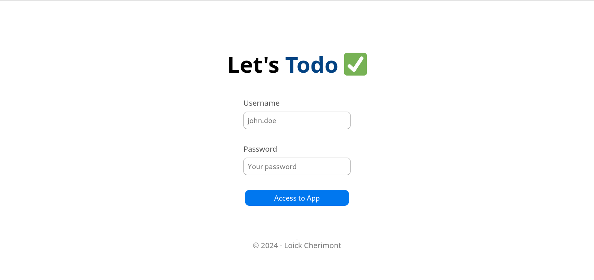

# TodoList_Go




## :information_source: About  

This is a back-end project type "Todolist" made with Go.


## :wrench: Tools
- Go 1.22.6
- HTML/CSS
- MySQL 8.4.2 


## :inbox_tray: Setup for contributions

1. Open a terminal and paste these lines

```bash
git clone git@github.com:loickcherimont/Todolist_Go.git

```

2. Go in the project and run it

```bash
# ./Todolist_Go

go get .

# Linux
go build main.go && go run ./main

# Windows
go build main.go && go run main.exe
```

3. Your terminal display : 
```bash
**************************************************

Connection 'mysql':
- Database: todolist
- Result: SUCCESS

Server OK and listening on http://localhost:3000/login 
To stop it press, Ctrl+C
**************************************************
```

Click on http://localhost:3000/login `, you are going to redirected on the login page.

## :warning: Prerequisites
<!-- Bullet list or simple sentence explaining what contributor needs for this project -->
- Add environment variables with DB logins
```bash
export DBUSER=your_dbuser
export DBPASS=your_dbpass
```

- Complete the DB using bash or directly in MySQL
```sql
CREATE DATABASE todolist;
USE todolist;
CREATE TABLE users (
  id         INT AUTO_INCREMENT NOT NULL,
  username      VARCHAR(255) NOT NULL,
  password     VARCHAR(255) NOT NULL, 
  PRIMARY KEY (`id`)
);

INSERT INTO users
  (username, password)
VALUES
  ('john.doe', '***yourpassword**'); # for test: test123
```

## :thinking: How does it run ?

Enter in your todolist account and create a task.
To test, to connect you have to use `username: john.doe` and `password:test123`.  
Good usage!  
Your contributions are welcome!  


## :test_tube: Features (for v1)
- Classic re-structuring (GO > Static files)


## :key: License

Developed by Loick Cherimont  

Under MIT License  

Last edition: 2024-08-17
